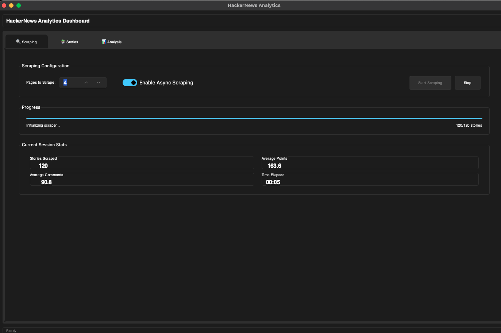
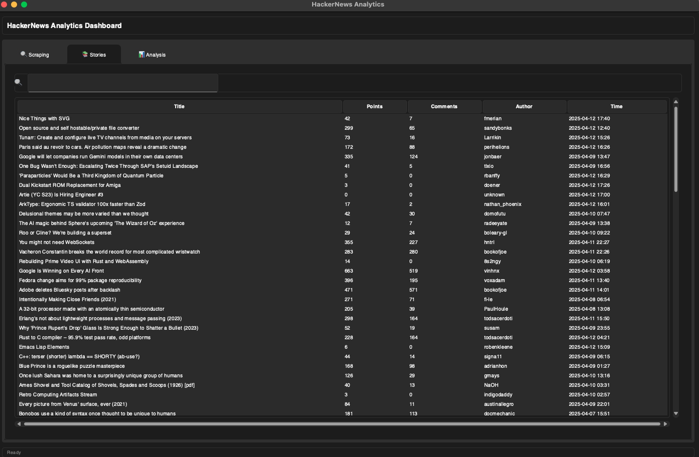
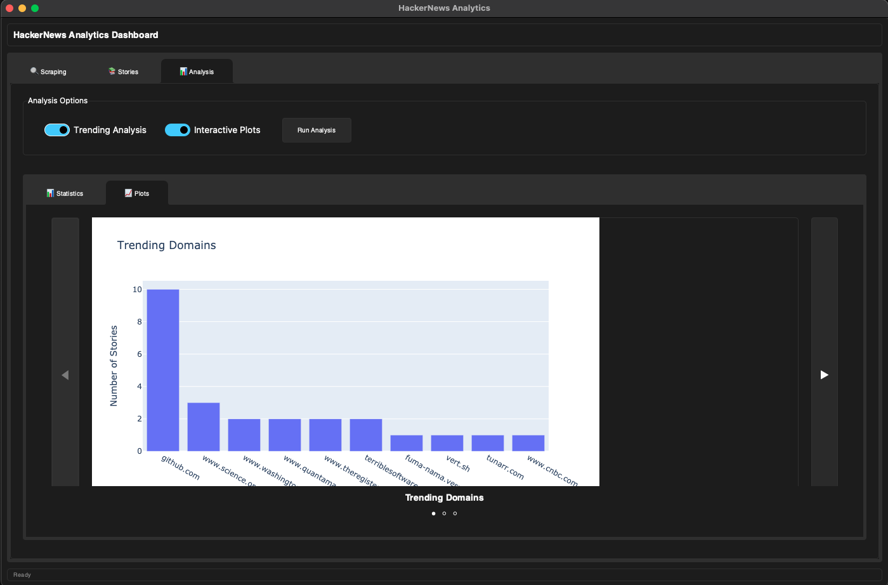

# HackerNews Scraper

A powerful and feature-rich web scraper for HackerNews that extracts story data, performs comprehensive analysis, and offers beautiful visualizations through both CLI and GUI interfaces.

## 🚀 Features

- **Efficient Scraping**: Both synchronous and asynchronous scraping capabilities
- **Smart Rate Limiting**: Respectful scraping with configurable rate limits
- **Rich Data Analysis**: Trending topics, domains, and comprehensive statistics
- **Beautiful Visualizations**: Generate insightful plots and charts
- **User-Friendly GUI**: Interactive graphical interface for easy data exploration
- **Flexible Storage**: Save and load scraped data in multiple formats
- **Robust Error Handling**: Comprehensive error management and logging

## 🛠️ Technologies Used

- **Python 3.x**
- **Web Scraping**:
  - BeautifulSoup4
  - Requests
  - aiohttp (for async scraping)
- **Data Analysis**:
  - Pandas
  - NumPy
  - NLTK
- **Visualization**:
  - Plotly
  - Kaleido
- **GUI**:
  - sv-ttk (Sun Valley theme for tkinter)
  - Pillow

## 📋 Prerequisites

- Python 3.8 or higher
- pip (Python package manager)
- Make (for using Makefile commands)

## 🔧 Installation

1. Clone the repository:

   ```bash
   git clone https://github.com/HattoriHanzo16/hackernews-scraper.git
   cd hackernews-scraper
   ```

2. Create and activate a virtual environment (recommended):

   ```bash
   python -m venv venv
   source venv/bin/activate  # On Windows: venv\Scripts\activate
   ```

3. Install dependencies:

   ```bash
   pip install -r requirements.txt
   ```

## 💻 Usage

### Command Line Interface

1. **Basic Scraping** (1 page):

   ```bash
   make run
   ```

2. **Custom Page Scraping**:

   ```bash
   make scrape PAGES=3
   ```

3. **Data Analysis**:

   ```bash
   make analyze
   ```

4. **Launch GUI**:

   ```bash
   make gui
   ```

### Advanced Usage

Run the script directly with more options:

```bash
python run.py --scrape --pages 5 --use-async --rate-limit 1.5
python run.py --analyze data/hn_stories --trending --plot
```

### Screenshots

#### User Interface Screenshots



#### Results of Analysis


## 📊 Sample Output

The analyzer generates various visualizations including:
- Trending domains distribution
- Post distribution by hour
- Karma distribution
- Points vs Comments correlation

All plots are saved in the `plots/` directory by default.

## 🗂️ Project Structure

```
hackernews-scraper/
├── hackernews_scraper/     # Main package directory
│   ├── core/              # Core functionality
│   ├── models/            # Data models
│   ├── config/            # Configuration
│   ├── exceptions/        # Custom exceptions
│   └── tests/            # Unit tests
├── data/                  # Scraped data storage
├── plots/                 # Generated visualizations
├── run.py                # Entry point script
├── requirements.txt      # Dependencies
└── Makefile             # Build automation
```

## 🛠️ Makefile Commands

- `make help`: Show available commands
- `make clean`: Clean up generated files
- `make test`: Run unit tests
- `make run`: Run basic scraping
- `make scrape PAGES=n`: Scrape n pages
- `make analyze`: Analyze scraped data
- `make gui`: Launch the GUI

## 🤝 Contributing

1. Fork the repository
2. Create your feature branch (`git checkout -b feature/AmazingFeature`)
3. Commit your changes (`git commit -m 'Add some AmazingFeature'`)
4. Push to the branch (`git push origin feature/AmazingFeature`)
5. Open a Pull Request

## 📝 License

This project is licensed under the MIT License - see the [LICENSE](LICENSE) file for details.


